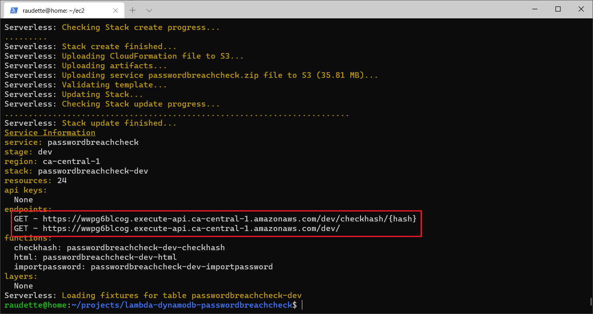
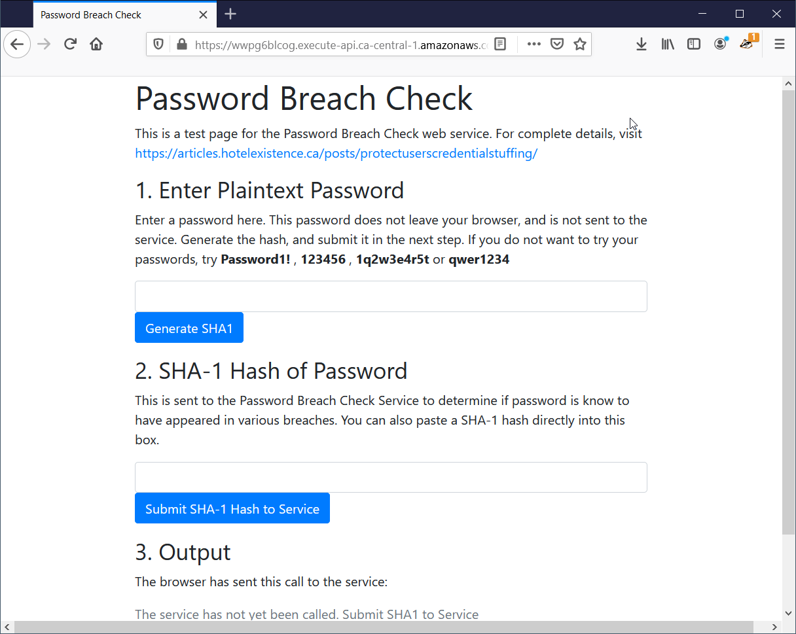
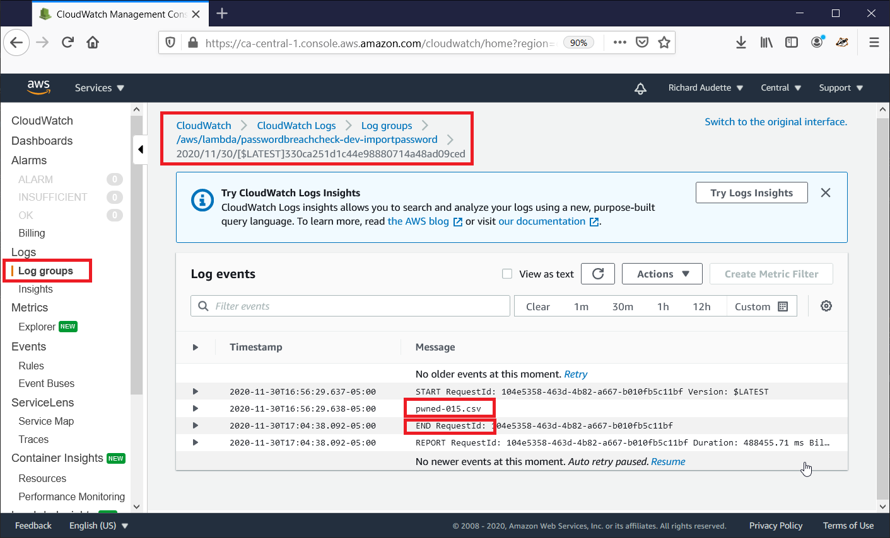

# lambda-dynamodb-passwordbreachcheck

An API to check passwords against the [haveibeenpwned.com](https://haveibeenpwned.com/Passwords) database without disclosing anything to a third party.  The service is built on AWS Lambda and DynamoDB, and leverages the Serverless framework.

For complete details, visit [https://articles.hotelexistence.ca/posts/protectuserscredentialstuffing/](https://articles.hotelexistence.ca/posts/protectuserscredentialstuffing/)

## Download and Deploy the Code

To complete this project, you need [NodeJS](https://nodejs.org/en/), [Git](https://git-scm.com/), and [AWS CLI](https://aws.amazon.com/cli/) installed, and an Amazon [AWS](https://aws.amazon.com/) account.

1. Download the code:
```
git clone https://github.com/raudette/lambda-dynamodb-passwordbreachcheck.git
```
2. You need to configure a AWS user that the Serverless framework can use to deploy the code.  Go to the [AWS Identity and Access Management](https://console.aws.amazon.com/iam/home) console.
3. Select Users
4. Add a user, enable programmatic access
5. In step 2, select "Attach existing policies directly"
6. A new browser tab opened.  On the Create Policy screen, select JSON, and paste the contents of the serverless_policy.json included with the code.  Save the policy.
7. Return to the browser tab where you created the user, and click refresh.  Search for the policy you created, and select it.
Continue through the steps without changing anything, until step 5.  An access key and secret is presented.  Record these values.
8. Return to your terminal window, and go to the folder where you downloaded the code.  Install the required node libraries:
```
npm install
```
9. Setup serverless by running:
```
node node_modules/serverless/scripts/serverless.js
```
10. Follow the prompts until you are asked for your AWS access keys.  Use the keys you created above in step 7.
11. You can now deploy the application as follows:
```
node node_modules/serverless/scripts/serverless.js deploy
```


12. Once the process has finished deploying, the Serverless tool will present two endpoints - record these endpoints.  You can also retrieve these endpoints from the [AWS API Gateway console](https://console.aws.amazon.com/apigateway/main/apis) by selecting the region, API, and then clicking on the dashboard.

NOTE: Your endpoints will be different from mine.  A custom domain can be assigned, but a random string is used by default.

13. The root endpoint hosts a web page you can use to test the web service - in my installation, this is:
https://wwpg6blcog.execute-api.ca-central-1.amazonaws.com/dev/

NOTE: To manage my AWS bill, this URL might not be live.  I share for illustrative purposes.

The test page looks like this:


Once deployed, the web service has pre-populated the breach database with 4 records - try them out: Password1! , 123456 , 1q2w3e4r5t and qwer1234

The web service can be integrated with your application.  Although it can be secured, it has been configured with no access controls.  In my installation this was:  
https://wwpg6blcog.execute-api.ca-central-1.amazonaws.com/dev/checkhash/{hash}

Your application can call the API with an HTTP GET, replace the {hash} with a SHA-1 hash of a password as follows:
https://{Your Endpoint}/dev/checkhash/7C4A8D09CA3762AF61E59520943DC26494F8941B

The end point should return:
```
{"passwordhash":"7C4A8D09CA3762AF61E59520943DC26494F8941B","timesseen":24230577}
```
Now, we have to populate the database with a list of breached passwords.

## Download and Setup the ihavebeenpwned Password Breach Database 

A Lambda function called importpassword was deployed as a part of the installation to populate the database.  This function is triggered by uploading a data file to an Amazon S3 bucket, and loads these records into the database.

We'll load Troy Hunt's ihavebeenpwned list, which can be downloaded from https://haveibeenpwned.com/Passwords . At the time of writing, this file contains a list of ~600M passwords.  Select the SHA-1, ordered by hash option.  As I was working on this project, I couldn't find samples of this file.  It is formatted as follows:
```
SHA1 Hash of Password:Number of Times Seen (the actual file has no header row)  
000000005AD76BD555C1D6D771DE417A4B87E4B4:4
00000000A8DAE4228F821FB418F59826079BF368:3
00000000DD7F2A1C68A35673713783CA390C9E93:630
00000001E225B908BAC31C56DB04D892E47536E0:5
00000006BAB7FC3113AA73DE3589630FC08218E7:2
00000008CD1806EB7B9B46A8F87690B2AC16F617:4
```
You will need lots of space to work with the file, as it is big, and we need to split it up to make it useful for our application.  Amazon Lambda functions have a [15 minute](https://docs.aws.amazon.com/lambda/latest/dg/gettingstarted-limits.html) maximum run time and a starting limit of [500 concurrent](https://docs.aws.amazon.com/lambda/latest/dg/invocation-scaling.html) calls.  In my testing, I could load about 1,000,000 records in 500 seconds - so we'll split the file into 1M row chunks, and run in separate batches.  Note that I personally stopped testing at 15M records - I am extrapolating from there.

1. First, we have to uncompress it with [7-zip](https://www.7-zip.org/).
```
7z e pwned-passwords-sha1-ordered-by-hash-v6.7z
```
2. Then, we'll split the file into 1,000,000 row chunks with [split](https://www.gnu.org/software/coreutils/manual/html_node/split-invocation.html).  If you are using Windows, it is included with the [Git for Windows](https://git-scm.com/download/win) package:
```
split -l 1000000 --numeric-suffixes --suffix-length=3 --additional-suffix=.csv pwned-passwords-sha1-ordered-by-hash-v6.txt pwned-
```

3. First, send files 0-99:
```
aws s3 cp ./ s3://passwordbreachcheck-dev/ --recursive --exclude "*" --include "pwned-0*"
```

4. Now, wait until the files are done processing - probably about 10 minutes after your last file has completed transfering.  You can monitor the process with [AWS CloudWatch](https://ca-central-1.console.aws.amazon.com/cloudwatch/home).  Click "Log Groups" on the left panel, and select "/aws/lambda/passwordbreachcheck-dev-importpassword".  You should see a stream for each file.  

5. Click on the most recent.  If the file is the last file of your batch, and you see an "End RequestId", your batch is complete.



6.  Repeat steps 3, 4, and 5 for the remaining batches.  Ensure you wait until each batch is complete before starting the next batch!
```
aws s3 cp ./ s3://passwordbreachcheck-dev/ --recursive --exclude "*" --include "pwned-1*"
aws s3 cp ./ s3://passwordbreachcheck-dev/ --recursive --exclude "*" --include "pwned-2*"
aws s3 cp ./ s3://passwordbreachcheck-dev/ --recursive --exclude "*" --include "pwned-3*"
aws s3 cp ./ s3://passwordbreachcheck-dev/ --recursive --exclude "*" --include "pwned-4*"
aws s3 cp ./ s3://passwordbreachcheck-dev/ --recursive --exclude "*" --include "pwned-5*"
```

7. You are done! The service is ready for use.

## Integrating the service with your application

As secure applications only store hashed passwords, it would not be possible to compare all your users' current passwords against the breach database.  Potential places to check are on password creation, password change, and user login.

Once the user types in their password, create a SHA-1 hash of the password ([Javascript example](https://stackoverflow.com/questions/50030059/how-can-i-encript-string-to-sha-1-using-javascript-or-jquery)).

Then make an HTTP GET call to:
https://{Your Endpoint}/dev/checkhash/{hash}
where {Your Endpoint} is the endpoint from Step 12, and hash is the SHA-1 hash of the password.

The end point should return:
```
{"passwordhash":"{hash}","timesseen":{The number of times this password has been seen}}
```

If timesseen is greater than 0, you will want to ask your user to select a new password.

Depending on your application, if you have many users who created their accounts long ago, as the Canada Revenue Agency did, you could consider invalidating old passwords, and requiring that your users reset their password using your new policy.

## Production Considerations

This project has not been used in production, has not been performance tested, and has not been peer reviewed.  That being said, it is pretty simple, and it only accepts password hashes over HTTPS.  As it leverages AWS Lambda functions, it should scale to 500 concurrent connections without further optimization.  After the first "warm up" call, it responds to calls in 70-100 ms.

If you use this project as a basis for your implementation, in addition to further review and testing, ensure:
- The HTML function is removed
- The checkhash call is limited to your service by implementing [API keys](https://docs.aws.amazon.com/apigateway/latest/developerguide/api-gateway-setup-api-key-with-console.html)
- The *passwordbreachcheck-dev* S3 bucket is emptied, as it isn't required after setup

## Clean Up

Once you are done with the service, you will want to remove it to stop incurring charges:

1. Remove the Lambda function, API, and code as follows:
```
node node_modules/serverless/scripts/serverless.js remove
```
2. There will be an error, as the user created for the Serverless framework does not have the required permissions to delete the *passwordbreachcheck-dev* AWS S3 bucket that was created during installation.  That has to be done through the [S3 console](https://s3.console.aws.amazon.com/s3/home).
3. The Serverless remove does not remove the *passwordbreachcheck-dev* DynamoDB table, this must also be deleted through its [console](https://console.aws.amazon.com/dynamodb/home).
4. Finally, delete the *passwordbreachcheck-dev* Cloudformation template through its [console](https://ca-central-1.console.aws.amazon.com/cloudformation/home).